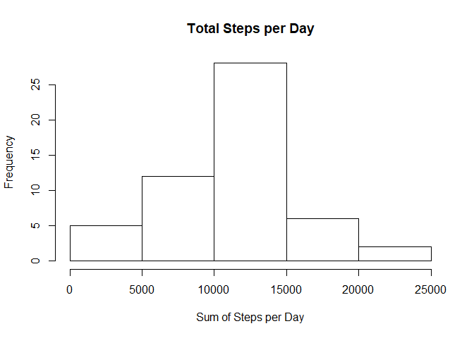
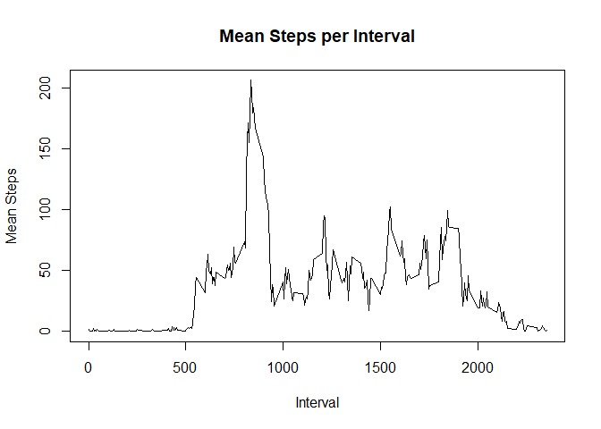
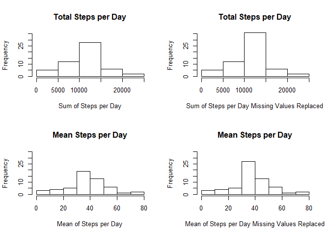
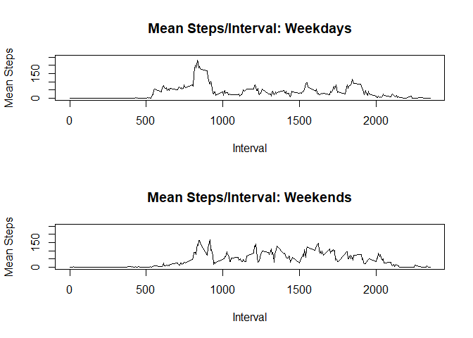

This document provides all of the information and code required to answer the

questions and make the plots required for the project.

First we will read the data from the local working directory

```r
activity<-read.csv("activity.csv")
```

Next we will aggregate the data by date and calculate the sum and plot the 
result in a histogram.


```r
stepsperday<-aggregate(steps ~ date, activity, sum)
hist(stepsperday$steps, main = "Total Steps per Day", xlab = "Sum of Steps per Day")
```

<!-- -->

Next we calculate the mean number of steps by day.


```r
aggregate(steps ~ date, activity, mean)
```

```
##          date      steps
## 1  2012-10-02  0.4375000
## 2  2012-10-03 39.4166667
## 3  2012-10-04 42.0694444
## 4  2012-10-05 46.1597222
## 5  2012-10-06 53.5416667
## 6  2012-10-07 38.2465278
## 7  2012-10-09 44.4826389
## 8  2012-10-10 34.3750000
## 9  2012-10-11 35.7777778
## 10 2012-10-12 60.3541667
## 11 2012-10-13 43.1458333
## 12 2012-10-14 52.4236111
## 13 2012-10-15 35.2048611
## 14 2012-10-16 52.3750000
## 15 2012-10-17 46.7083333
## 16 2012-10-18 34.9166667
## 17 2012-10-19 41.0729167
## 18 2012-10-20 36.0937500
## 19 2012-10-21 30.6284722
## 20 2012-10-22 46.7361111
## 21 2012-10-23 30.9652778
## 22 2012-10-24 29.0104167
## 23 2012-10-25  8.6527778
## 24 2012-10-26 23.5347222
## 25 2012-10-27 35.1354167
## 26 2012-10-28 39.7847222
## 27 2012-10-29 17.4236111
## 28 2012-10-30 34.0937500
## 29 2012-10-31 53.5208333
## 30 2012-11-02 36.8055556
## 31 2012-11-03 36.7048611
## 32 2012-11-05 36.2465278
## 33 2012-11-06 28.9375000
## 34 2012-11-07 44.7326389
## 35 2012-11-08 11.1770833
## 36 2012-11-11 43.7777778
## 37 2012-11-12 37.3784722
## 38 2012-11-13 25.4722222
## 39 2012-11-15  0.1423611
## 40 2012-11-16 18.8923611
## 41 2012-11-17 49.7881944
## 42 2012-11-18 52.4652778
## 43 2012-11-19 30.6979167
## 44 2012-11-20 15.5277778
## 45 2012-11-21 44.3993056
## 46 2012-11-22 70.9270833
## 47 2012-11-23 73.5902778
## 48 2012-11-24 50.2708333
## 49 2012-11-25 41.0902778
## 50 2012-11-26 38.7569444
## 51 2012-11-27 47.3819444
## 52 2012-11-28 35.3576389
## 53 2012-11-29 24.4687500
```

And the median.


```r
aggregate(steps ~ date, activity, median)
```

```
##          date steps
## 1  2012-10-02     0
## 2  2012-10-03     0
## 3  2012-10-04     0
## 4  2012-10-05     0
## 5  2012-10-06     0
## 6  2012-10-07     0
## 7  2012-10-09     0
## 8  2012-10-10     0
## 9  2012-10-11     0
## 10 2012-10-12     0
## 11 2012-10-13     0
## 12 2012-10-14     0
## 13 2012-10-15     0
## 14 2012-10-16     0
## 15 2012-10-17     0
## 16 2012-10-18     0
## 17 2012-10-19     0
## 18 2012-10-20     0
## 19 2012-10-21     0
## 20 2012-10-22     0
## 21 2012-10-23     0
## 22 2012-10-24     0
## 23 2012-10-25     0
## 24 2012-10-26     0
## 25 2012-10-27     0
## 26 2012-10-28     0
## 27 2012-10-29     0
## 28 2012-10-30     0
## 29 2012-10-31     0
## 30 2012-11-02     0
## 31 2012-11-03     0
## 32 2012-11-05     0
## 33 2012-11-06     0
## 34 2012-11-07     0
## 35 2012-11-08     0
## 36 2012-11-11     0
## 37 2012-11-12     0
## 38 2012-11-13     0
## 39 2012-11-15     0
## 40 2012-11-16     0
## 41 2012-11-17     0
## 42 2012-11-18     0
## 43 2012-11-19     0
## 44 2012-11-20     0
## 45 2012-11-21     0
## 46 2012-11-22     0
## 47 2012-11-23     0
## 48 2012-11-24     0
## 49 2012-11-25     0
## 50 2012-11-26     0
## 51 2012-11-27     0
## 52 2012-11-28     0
## 53 2012-11-29     0
```

Now we'll look at steps by time period instead of date and plot the results
by interval.


```r
periodmeans<-aggregate(steps~interval, activity, mean)
plot(periodmeans$interval, periodmeans$steps, type = "l", main = "Mean Steps per Interval", xlab = "Interval", ylab = "Mean Steps")
```

<!-- -->

Now we will comupte in which interval the maximum mean number of steps occurs.


```r
maxinterval<-periodmeans$interval[ which.max(periodmeans$steps)]
```

The interval with the most steps is 835

The data has many NAs in the steps column. Let's see how many.


```r
sum(is.na(activity$steps))
```

```
## [1] 2304
```
Now I'll replace the NA values with the mean value for the corresponding interval in a new column called steps2.


```r
activity2<-activity

activity2$steps2<-activity2$steps
for (row in 1:nrow(activity2)) {
    
    intval<-activity2$interval[row]  ## determine interval of current row
    introw<- which(periodmeans$interval== intval) ##find row number for that value
    pmean<-periodmeans$steps[introw]  ## set pmean to the mean of steps for that interval
   
     ## Now replace NA vlaues with mean for the same interval
    if( is.na(activity2$steps2[row])) {
        activity2$steps2[row]<-pmean
    }
}
```

Now lets do some side by side comparisons to see the effect of replacing the NA values.


```r
par(mfrow=c(2,2))


hist(stepsperday$steps, ylim = c(0,35), main = "Total Steps per Day", xlab = "Sum of Steps per Day")

stepsperday2<-aggregate(steps2 ~ date, activity2, sum) 
hist(stepsperday2$steps2, ylim=c(0,35), main = "Total Steps per Day", xlab = "Sum of Steps per Day Missing Values Replaced")

## Now compare means  for original and adjusted data

daymeans<-aggregate(steps ~ date, activity, mean)
hist(daymeans$steps, ylim = c(0,35), main = "Mean Steps per Day", xlab = "Mean of Steps per Day")

daymeansNAreplaced<-aggregate(steps2 ~ date, activity2, mean)
hist(daymeansNAreplaced$steps2, ylim = c(0,35), main = "Mean Steps per Day", xlab = "Mean of Steps per Day Missing Values Replaced")
```

<!-- -->

For a final comparison we'll look at a graph of the steps per interval on weekends versus weekdays in side by side plots.


```r
activity3<-activity2

activity3$daytype<-ifelse(weekdays(as.Date(activity$date)) %in% c("Saturday", "Sunday"), "weekend", "weekday")

subweekday<- subset(activity3, daytype=="weekday")
subweekend<- subset(activity3, daytype=="weekend")

par(mfrow=c(2,1))
intmeanswd<-aggregate(steps2 ~interval, subweekday, mean)
plot(intmeanswd$interval, intmeanswd$steps2, type = "l", ylim = c(0,250), main = "Mean Steps/Interval: Weekdays", xlab = "Interval", ylab = "Mean Steps")

intmeanswe<-aggregate(steps2 ~interval, subweekend, mean)
plot(intmeanswe$interval, intmeanswe$steps2, type = "l", ylim = c(0,250), main = "Mean Steps/Interval: Weekends", xlab = "Interval", ylab = "Mean Steps")
```

<!-- -->


